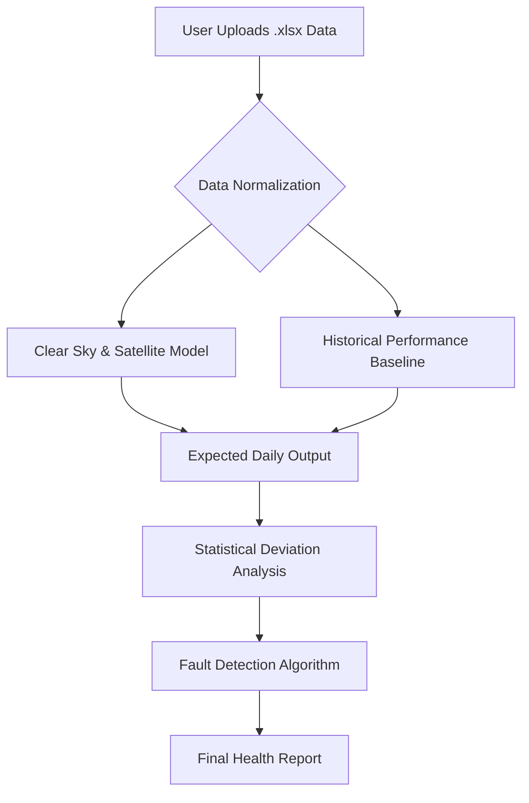

# Product Proposal: SolarSense Analytics

## Executive Summary
**SolarSense Analytics** is a diagnostic platform designed for small-scale solar cooperatives. By transforming daily operational logs into actionable health reports, the platform identifies underperformance, faults, and degradation without requiring high-frequency hourly data. We provide the intelligence to ensure your cooperative maximizes its energy yield and investment longevity.

***

## The Value Proposition
Current management methods—typically manual spreadsheet tracking—are cumbersome and lack the nuance to distinguish between environmental fluctuations and genuine system faults. SolarSense bridges this gap by comparing your **actual daily output** against a **modeled "Clear Sky" baseline**, allowing cooperatives to pinpoint issues like string failures or inverter degradation with statistical confidence.

***

## System Architecture
The platform operates by synthesizing localized weather data with your system’s physical specifications to create a digital twin of expected performance.

### Process Flow

***

## Interface Design

### 1. Developer Interface (The Model Workbench)
Designed for data scientists and analysts to tune the statistical sensitivity of the models.

* **Parameter Configuration:** Inputs for azimuth, tilt, panel efficiency, and inverter specs.
* **Model Tuning:** Interface to adjust "Cloud Attenuation" coefficients and satellite radiation inputs.
* **Validation Dashboard:** Side-by-side view of raw input vs. simulated output to calibrate confidence scores.

### 2. End-User Interface (The Cooperative Dashboard)
Designed for non-technical stakeholders to quickly assess site health.

| Feature | Description |
| :--- | :--- |
| **Site Overview** | Map view of all arrays with current health status (Healthy, Warning, Fault). |
| **Fault Alerting** | Automated notification: "Array 4 (String B) showing 15% underperformance on April 22." |
| **Degradation Tracker** | Long-term trend lines showing output efficiency over years. |
| **Upload Center** | Drag-and-drop interface for monthly `.xlsx` exports from meters. |

***

## Technical Considerations & Safety
* **Modeling Logic:** The platform uses a 30-year climate simulation model to create an "Expected Yield" baseline. By subtracting the Actual Daily Output from the Expected Yield, the software isolates performance gaps.
* **External Verification:** **Crucial Note:** All automated fault detections generated by this platform are analytical estimations based on statistical probability. These results should be treated as **diagnostic suggestions** rather than absolute physical proof. We strongly recommend manual, on-site technical inspection by a qualified electrician before disconnecting hardware or performing repairs based on software-generated alerts.
* **Data Constraints:** Because the system operates on daily aggregates rather than hourly snapshots, it is optimized for identifying sustained faults (string/inverter issues) rather than momentary shading events.

***

## Strategic Roadmap
1.  **Phase 1 (MVP):** Standardize the `.xlsx` ingestion pipeline and implement the "Clear Sky" base model.
2.  **Phase 2 (Automation):** Develop API integration for direct meter communication to remove the burden of manual file uploads.
3.  **Phase 3 (Predictive):** Introduce machine learning to distinguish between "weather-related" attenuation and "hardware degradation" based on historical trends.

---

### Follow-up
Would you like me to elaborate on the specific statistical methods (e.g., Z-score analysis or regression modeling) that would be most effective for detecting string-level faults using only daily aggregate data?
